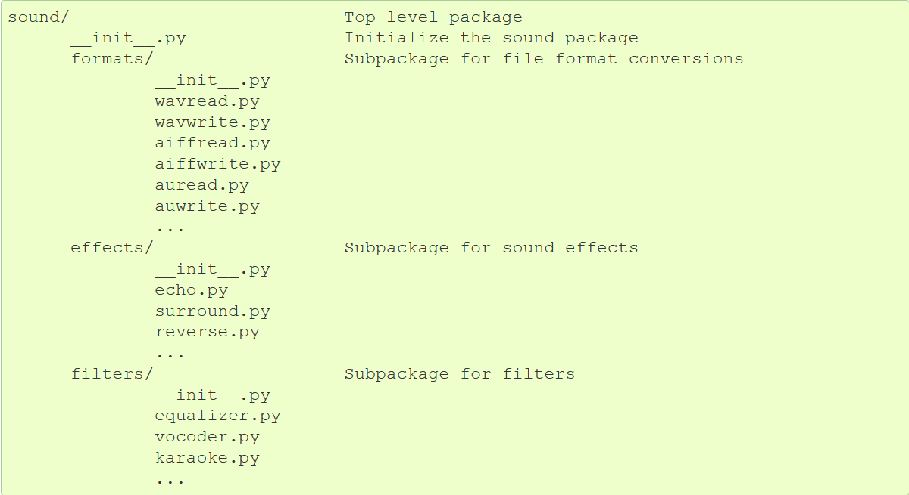
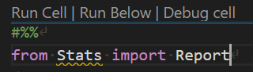
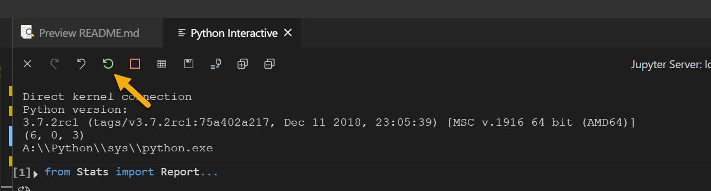
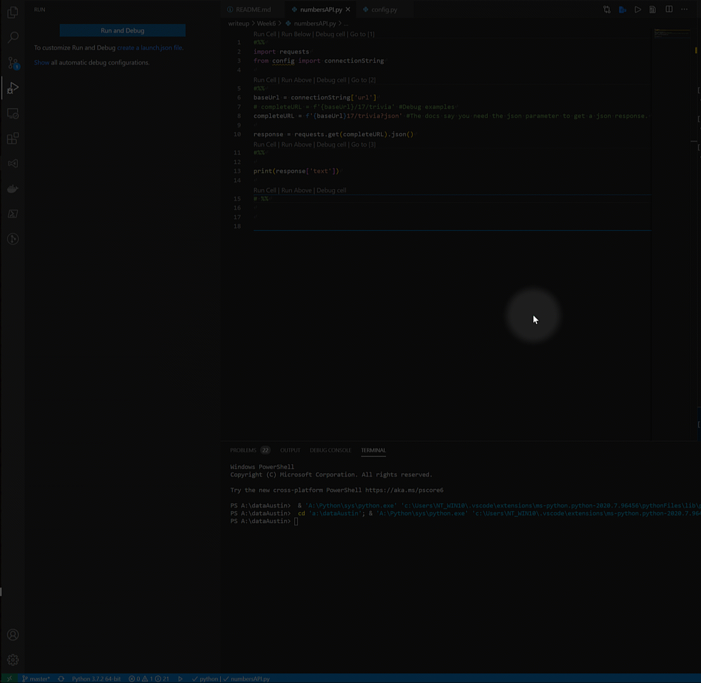
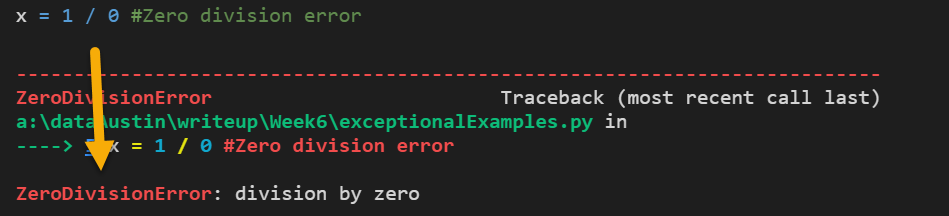

# Recommended Session


## Overview


### Objectives:
* package creation and importing
* \_\_init__.py
* create and import a config from a config file
* .gitignore
* Introduce API Endpoints
* `requests` module

> **Optional**: Review [skewness.ipynb](Week6/skewness/skewness.ipynb) and discuss the Statistics report.

#### 1. Create a package from Statistics Report and import it in a script

##### [Folder Structure](https://docs.python.org/3/tutorial/modules.html#packages)



Nested packages and modules will follow a dotted syntax that is the same as the folder structure. For example to import `WaveReader` from `wavread.py` the package import directive should be:

``` python
from sound.formats.wavread import WaveReader
```

##### [\_\_init__.py](https://docs.python.org/3/tutorial/modules.html#more-on-modules)

The `__init__.py` file is required for a package directory structure to be parsed by the python module import machinery. If an init file is not included the module can still be referenced if its in the same directory as the script reference it. Any calls to the package will fail though if it is not in the same directory.

By utilizing the `__init__.py` the python import will parse the directory as being importable packages. The code that is in `__init__.py` will be run once at import. This will be useful later when dealing with [concurrency in databases in SqlAlchemy](https://docs.sqlalchemy.org/en/13/orm/session_basics.html#when-do-i-make-a-sessionmaker).


##### [\_\_pycache___ and .pyc](https://docs.python.org/3/tutorial/modules.html#compiled-python-files)

These are compiled files used by the python interpreter to speed execution. They should be added to a .gitignore.

##### [.gitignore](https://git-scm.com/docs/gitignore)

.gitignore contains a list of regex patterns that git should not track.

>**Note**: git will only respect the .gitignore file if the file not to be tracked does not exist in the remote repository. If the file does exist git will ignore the .gitignore and track the file anyways. The file must be removed from the remote before git will obey the .gitignore.


### Create script: [Stats.py](Week6/StatsModule/Report/Stats.py) and [carsInCassCounty.py](Week6/carsInCassCounty.py)

Create empty scripts with the above name in the same directory and copy the code from the above stats file into the Stats.py file.

Using code blocks in VSCode, add the following code in `carsInCassCounty.py`:

``` python
#%%
from Stats import Report
```
>**Note**: The `#%%` will be interpreted by VSCode as a magic command and is the same as a jupyter notebook cell. Click run cell to start a jupyter kernel in VSCode.



The `Stats` package is able to import. Nest the `Stats` package in a folder name StatsModule and now try to import the Report. An error is thrown and a `__init__.py` file must be used to initialize the directory as containing a python package. 

Create an `__init__.py` file in the StatsModule directory. The import should now work with the import directive:
``` python
from StatsModule.Stats import Report
```

Now create a folder in StatsModule named Report and move Stats in it. The new import directive should be:
``` python 
from StatsModule.Report.Stats import Report
```

However it will fail as an `__init__.py` file in the Report directory.

Create the init file and then open both init files in StatsModule and report.

In the StatsModule init file add:

``` python
print("Hello from StatsModule")
```

In the Report init file add:
``` python
print("Hello from Report")
```

>**Note**: The code in the init files will be run once only when the packages are imported and not again even if the import statement is rerun. To demo the code running in the init file you will need to restart the jupyter kernel and re import. In VsCode go to the refresh icon in the interactive python session.



Below is the rest of the script. The dataset is discussed in [skewness.ipynb](Week6/skewness/skewness.ipynb). Feel free to add your own insights.

``` python
#%%
# from Stats import Report
# from StatsModule.Stats import Report

from StatsModule.Report.Stats import Report
import matplotlib.pyplot as plt
import numpy as np
import math

#%%
carsInCassCounty = [1432,9634,15959,7853,3828] #Index corresponds to household size per vehicles available.
carsPerHousehold = [x for x in range(0,len(carsInCassCounty))]

plt.plot(carsPerHousehold,carsInCassCounty)
carsReport = Report(carsPerHousehold,carsInCassCounty)
print(carsReport)

```

Add the following patterns to a .gitignore file:
```
config.py
config.*
__pycache__
*.pyc
```

Explain to students that we do not want config files or compiled files to be tracked in the repository.

#### 2. Create and import a `config.py` file

Create a file named `config.py`. Explain to students that any python object may be imported into another script and because of that it is really easy to make config files in python. We will want to keep any API authentication credentials out of our github repository. To do this will we will store the credentials in an config file then add the config file to the .gitignore so it doesn't wind up in the repository.

>**Class Discussion**: What would be a good object type to hold credentials? List,Dictionary, Class etc.

Create a dictionary to hold the credentials in config.py:

``` python

connectionString = {
    "url" : 'http://numbersapi.com/',
    'userName' : 'admin',
    'password' : 'admin'
}

```

Create a new file myProgram.py and import the connection string. Print the userName:

``` python 

#%%
from config import connectionString

# %%
print(connectionString["userName"])

# %%

```

#### 3. NumbersAPI

**Review** the [numbersAPI](http://numbersapi.com/#42) documentation with the class. Demonstrate that the most reliable way to understand what an API endpoint expects and returns is to look at the documentation. It may help to have the documentation up next to the editor so that students can see what the instructor is looking at.

Review the composition of a url and how parameters are passed.

[`requests` Doc](https://requests.readthedocs.io/en/master/user/quickstart/)

>**Note**: Students might assume that any API will require authentication. Explain that like html webpages for people that authentication is not mandatory for the developers to implement. Does numbersapi require authentication?

**[]()**

**[config.py](Week6/config.py)**
``` python 
connectionString = {
    "url" : 'http://numbersapi.com/',
    'userName' : 'admin', #Example Only
    'password' : 'admin' #Example Only
}
```

**[numbersAPI.py](Week6/numbersAPI.py)**

``` python
#%%
import requests
from config import connectionString

#%%
baseUrl = connectionString['url']
# completeURL = f'{baseUrl}/17/trivia' #Debug examples
completeURL = f'{baseUrl}17/trivia?json' #The docs say you need the json parameter to get a json response.

response = requests.get(completeURL).json()
#%%

print(response['text'])

# %%

```

>**Debug Tip:** Try `completeURL = f'{baseUrl}/17/trivia'` This will ad an extra slash to the URL and will result in a bad path. Set a breakpoint in vsCode at the `print(response["text"])` to look at the interpolated url and response object.



### Breakout Room : SpaceX API


Now its the students turn. Slack out the [documentation page](https://docs.spacexdata.com/?version=latest). Students should choose one endpoint and print the response. Create breakout rooms and have students use the numbersApi script as a starting point.

 The instructor and TAs will assist student groups who have questions.  Discuss student results and different approaches after returning from the breakout room. Students can post their results in the class slack channel.

---

# Required Session


## Overview


### Objectives:
* try/except blocks
* custom errors
* review module import and config file
* debugging api requests in vscode

#### 1. Exceptional Examples

##### [`Exception`](https://docs.python.org/3/tutorial/errors.html#user-defined-exceptions)
`Exception` is the base class that all other exceptions are derived from. The following is a demonstration of exception handling and custom error messages.

[exceptionalExamples.py](Week6/exceptionalExamples.py)

Demonstrate a `ZeroDivisionError`. Bring notice to python telling the error.


 Catch it with the `Exception` class. 
``` python

#%%
x = 1 / 0 #Zero division error

#%%

try:
    x = 1 / 0
except Exception as someAlias:
    print(someAlias)

```

It can also be caught with the `ZeroDivisionError` class. Compare that the `Exception` class will always catch all errors so it is best used as a catch all case.

``` python
#%%

try:
    x = 1 / 0
except ZeroDivisionError as someAlias:
    print(f"zero div. error: {someAlias}")
except Exception as e:
    print(f"Final Case: {e}")


#%%

#Order Matters. The Execption base class will catch all exceptions so be careful to use it as a final case.
try:
    x = 1 / 0
except Exception as e:
    print(f"Final Case: {e}")
except ZeroDivisionError as someAlias:
    print(f"zero div. error: {someAlias}")


```

Custom Error messages can be created by inheriting from the `Exception` base class. It will be useful to create custom exceptions when dealing with http reqeusts/responses. Errors maybe raised using the `raise` keyword.

``` python

#%%
class myErrorMessage(Exception):

    def __init__(self,expression, message):
        self.expression = expression
        self.message = message

#%%
x = 1
y = 2
try:
    if x == y:
        pass
    else:
        raise myErrorMessage("ERROR","UIX-2556") #Makes vba proud!
except myErrorMessage as e:
    print(f"Custom Error: {e.expression}:{e.message}! N1c3:)")

```

Use the previous two exception examples to create the script below. Two more exception cases are added for a `NameError` and `IndexError`. We need a loop to throw all of the exceptions. Multiple Error classes can be handled by an except block. For example, `except (ZeroDivisionError, IndexError) as e:` will catch all `ZeroDivisionError` and `IndexError`.

``` python

# %%

for i in range(0,5):
    try:    
        if i % 2 == 0:
            x = 1/0 # zeroDivsionError
        elif i % 3 == 0:
            x = [0,1,2,3] #index out of range
            for i in range(0,5):
                print(x[i])

            print(someUndefinedVariable) #NameError
        else:
            x = 1
            y = 2
            if x == y:
                pass
            else:
                raise myErrorMessage("ERROR","UIX-2556")
# except ZeroDivisionError as theErrorMessage:
#     # print("There was an error")
#     print(f"There was a zero division error: {theErrorMessage}")
# except IndexError as e:
#     print(e)
    except (ZeroDivisionError, IndexError) as e: #Multiple exceptions can be handled in the same except block
        print(f"Multi error handler: {e}")
    except NameError as someNameErrorMessage:
        print(f"{someNameErrorMessage}")
    except myErrorMessage as e:
        print(f"Custom Error: {e.expression}:{e.message}! N1c3:)")
    except Exception: #Final catch all
        print("Something unknown happened")

```

#### 2. NYT API

Open and slack out the [API documentation page](https://developer.nytimes.com/apis).

Create an account and add your api key to the `config.py` file.
``` python

nytConnectionDictionary = {
    "baseURL" : "https://api.nytimes.com/svc/search/v2",
    "apiKey" : "", #Add your own
    "appId" : ""
}

```

[nyTimesAPI.py](Week6/nyTimesAPI.py)

``` python

#%%
from config import nytConnectionDictionary
import requests

#%%
baseUrl = nytConnectionDictionary["baseURL"]
apiKey = nytConnectionDictionary["apiKey"]
endPoint = "articlesearch.json"
queryString = ""
beginDate="" #optional
endDate = "" #optional


requestURL = f"{baseUrl}/{endPoint}?q={queryString}&api-key={apiKey}"

if beginDate != "":
    requestURL = requestURL + f"&begin_date={beginDate}"
if endDate != "":
    requestURL = requestURL + f"&end_date={endDate}"

#%%
class requestError(Exception):
    def __init__(self,expression, message):
        self.expression = expression
        self.message = message

#%%
responseJson = None
try:
    response = requests.get(requestURL)
    if response.status_code == 200:
        # print(response.json())
        responseJson = response.json()
    else:
        raise requestError("The response status code is:",response.status_code)
except requestError as theError:
    print(f"{theError.expression} : {theError.message}")


        

# %%
print(response.status_code)

# %%
print(responseJson)

# %%
responseJson["response"]["docs"][0]["abstract"]

# %%


```


### Breakout Room: TvRatings API

Slack out: [Stu_TvRatings](Week6/TvRatings/Stu_TvRatings.ipynb) and the [README](Week6/TvRatings/README.md).

[tvRatings.py](Week6/TvRatings/tvRatings.py)

``` python 

# To add a new cell, type '# %%'
# To add a new markdown cell, type '# %% [markdown]'
# %%
#Dependencies
import requests
import json
import pandas as pd
import numpy as np
import matplotlib.pyplot as plt


# %%
#list of tv show titles to query
tv_shows = ["Altered Carbon", "Grey's Anatomy", "This is Us", "The Flash", "Vikings", "Shameless", "Arrow", "Peaky Blinders", "Dirk Gently"]

# make iterative requests to TVmaze search endpoint

baseUrl = "http://api.tvmaze.com/singlesearch/shows?q="


# %%


ratingsDictionary = {} # "title" : "rating"
#%%
class customError(Exception):
    def __init__(self,expression,message):
        self.expression = expression
        self.message = message
        

#%%
for show in tv_shows:
    try:
        requestURL = baseUrl + show
        response = requests.get(requestURL)
        responseJson = response.json()
        if response.status_code == 200:
            print(responseJson)
            title = show
            rating = responseJson["rating"]["average"]
            ratingsDictionary[title] = [rating]
            badAssignment = nonExistentVariable
        else:
            raise customError("The status code is:",response.status_code)
    except customError as aVariableName:
        print(f'{aVariableName.expression} {aVariableName.message}')
    except NameError as e:
        print(e)
    except Exception as e:
        print(f"Final case of errors if not handled previously : {e}")


#%%
# create dataframe
tvRatingsDF = pd.DataFrame({
    "title" : list(ratingsDictionary.keys()),
    "rating" : list(ratingsDictionary.values())
})

# %%
# use matplotlib to create a bar chart from the dataframe

plt.bar([x for x in range(0,len(tvRatingsDF))],tvRatingsDF["rating"])


# %%
tvRatingsDF.plot()

# %%


```
